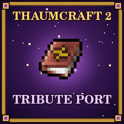

# Thaumcraft 2 Tribute Port for Minecraft 26.1.2

<p align="center"></p>

> **A tribute**
>
> Azanor started working on Thaumcraft 2 almost 15 years ago, and the latest update of Thaumcraft 6 was 8 years ago. We look forward to the day Team CoFH gives us a new Thaumcraft. Until then, I have spent hundreds of hours porting my favorite version of Thaumcraft.
>
> This mod is a tribute to Azanor's amazing work, so that everyone can enjoy it freely in today's Minecraft. Appreciate the work, and have fun!
>
> — Alt

> **About this port**
>
> This port is first of all for people who played the original Thaumcraft 2 and want to enjoy it again, together with friends. Its adaptations are limited to what multiplayer needs and to what Minecraft has changed since 1.2.5; everything else aims to keep the experience as close to the original as possible.
>
> The [addon API](docs/addon-api.md) for addon mods and datapacks is comprehensive. For the general public, the suggested way to play is through a modpack whose creator has adapted the mod to the pack.
>
> [Alt's patches](examples/alts-tc2tp-patches/README.md) are my own addon. They subjectively make the mod more enjoyable for the general public, but they include changes that nobody has endorsed and that are not the gameplay Azanor intended. They are optional and separate from the port.

An unofficial modern port of Azanor's **Thaumcraft 2.1.6d**, based on original resources. It targets **Minecraft 26.1.2** on **Fabric** and **NeoForge** with a shared gameplay implementation.

The port includes the original 70 research projects, 73 effective infusion recipes representing 113 legacy registrations, and 67 crafting recipes, classic textures and sounds, adapted machine models, vis networks, arcane equipment, seals, mobs, trees, taint and Eldritch chambers. It adds modern interfaces and the gameplay adaptations multiplayer needs, which the original lacked because of the limits of 1.2.5 modding.

## Install

Use Java 25 and a new Minecraft **26.1.2** instance. Install exactly one loader and the corresponding port JAR on both the client and dedicated server. Download the JAR for your loader from the GitHub Releases page; Alt's patches are attached to the same release; they are optional.

| Loader | Version used for this build | Additional dependency |
| --- | --- | --- |
| Fabric Loader | 0.19.5 | Fabric API 0.155.3+26.1.2 |
| NeoForge | 26.1.2.107 | None beyond NeoForge |

## Start playing

Begin with a Quaesitum: in a crafting table, place feather / glass bottle / ink sac across the top row, three gold ingots in the middle, and three stone blocks across the bottom. A Crucible uses a crystal above a cauldron above a furnace. Study materials in the Quaesitum to obtain knowledge fragments and theories.

Craft a Thaumonomicon from a book surrounded by eight knowledge fragments, or from a book with one discovery above, below, left and right. Its four bookmarks organize research by category; click the arrows to browse discoveries and their recipes. Discoveries show their research description and associated recipes; studying a discovery unlocks its recipes for that player. Prerequisites govern which theories the Quaesitum can generate.

## Build and verify

From this project directory with a Java 25 JDK selected:

```bash
./gradlew :fabric:build :neoforge:build --console=plain
```

The Gradle wrapper downloads the required build dependencies. See [docs/BUILDING.md](docs/BUILDING.md) for development launches, isolated server assertions and client screenshots.

## Source and attribution

Original Thaumcraft 2 is by Azanor. It is built on [MultiLoader Template, branch 26.1.2](https://github.com/jaredlll08/MultiLoader-Template/tree/26.1.2) by Jaredlll08.

The port's own code, the addon API, the examples and Alt's patches are free software under the [GNU GPL, version 3 or later](COPYING). The original Thaumcraft 2 code, art, sounds and text remain Azanor's, All Rights Reserved, and are not covered by the GPL. [LICENSE](LICENSE) explains which is which; the MultiLoader Template's CC0 notice is in [LICENSE-MultiLoader](LICENSE-MultiLoader).

## Addons integration

[Addon API v1](docs/addon-api.md) documents the complete current addon contract on Fabric and NeoForge, including data pack recipes and world rules, research and crafting locks, vis networks and aura, events, shared research, and integration adapters. A [working example pack](examples/addon-api), [examples cookbook](docs/addon-examples.md), and the common `dev.thaumcraft.api.ThaumcraftApi` entry point are included. [Alt's patches](examples/alts-tc2tp-patches/README.md) is a complete Java addon that also works as a datapack.

## Modpack creators

We are open to extending the [addon API](docs/addon-api.md) and datapack support to make it as easy as possible to integrate the mod well into your pack. Open a GitHub issue and describe what you need; we will tackle it if we can.

## Contributing

Anything that does not work as it did in the original is considered a bug. Open a GitHub issue with a screenshot or video; fixes are best effort. See [CONTRIBUTING.md](CONTRIBUTING.md) for what to include and for pull requests.
